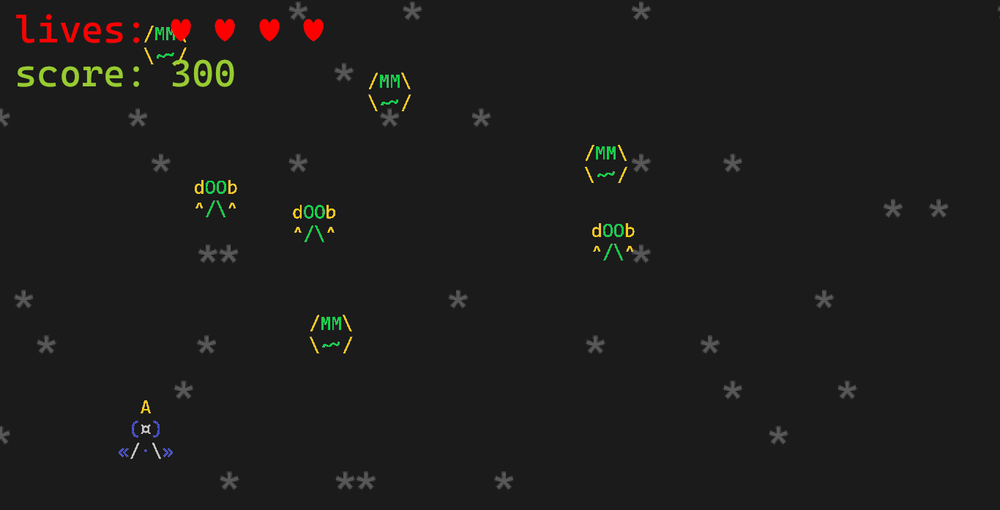

<h1 align="center">hShip ][: <i>the last voyage</i></h1>

The direct sequel to my old ship game made with ASCII characters

hShip ][: *the last voyage*, is the **direct sequel** to my ASCII character ship game: [hShip](https://github.com/h3nry-d1az/rShip),
but instead of running in the terminal, this title emulates its aesthetics through **sprites made with ASCII characters** while the game itself is executed in any window thanks to the [Bevy](https://bevyengine.org/) engine,
allowing a **better experience** as well as **better visual effects** and **sound**.

Also, this game is *(like most of my titles)* published on the [itch.io](https://itch.io/) platform, so you can find *this same information* as well as *download the game binaries* more easily on [that page](https://h3nry-d1az.itch.io/hShip2).

### Install instructions
#### Get the already compiled binary
1. **Click on the** *hShip2.Win64.zip* **file** and then **unzip it**.
2. Then **execute the file with extension .exe** contained in the newly extracted folder *(hShip2.exe)*.
3. *(Optional)* **Move the newly extracted directory to a safe location** *(such as* `C:\`*)* and **add the folder to your** `PATH` **variable**.

#### Build the project from source code
1. **Click on the** *hShip2.Source.zip* **file** and then **unzip it**, or **clone the repository via git** *(run* `git clone https://github.com/h3nry-d1az/hShip2.git` *in* **CMD** *or* **PowerShell** *)*.
2. **Then compile it using cargo** *(if you don't have* **Rust** *installed go* [here](https://www.rust-lang.org/)*)* **using the command** `cargo build --release` if you want to build **just the binary** or **run** `cargo install --path .` to **install it**.

#### Easiest method *(requires* [Rust installed](https://www.rust-lang.org/) *)*
1. Just **run the command** `cargo install --git https://github.com/h3nry-d1az/hShip2.git` and **wait for it to finish**.

### Gameplay
#### Instructions
**hShip ][**, like its previous version, is an **infinite spaceship game** in which your task will be to **kill the aliens** by shooting missiles at them while avoiding them to **kill you** in the same way.

For every enemy you kill you will get **100 points**, and when you get **2000** you will get an **extra life**.

#### Normal controls
<table>
<thead>
  <tr>
    <td><b>Key</b></td>
    <td><b>Action</b></td>
  </tr>
</thead>
<tbody>
  <tr>
    <td><kbd>W</kbd> / <kbd>↑</kbd></td>
    <td>Move the ship <b>up</b></td>
  </tr>
  <tr>
    <td><kbd>A</kbd> / <kbd>←</kbd></td>
    <td>Move the ship <b>left</b></td>
  </tr>
  <tr>
    <td><kbd>S</kbd> / <kbd>↓</kbd></td>
    <td>Move the ship <b>down</b></td>
  </tr>
  <tr>
    <td><kbd>D</kbd> / <kbd>→</kbd></td>
    <td>Move the ship <b>right</b></td>
  </tr>
  <tr>
    <td><kbd>⎵</kbd></td>
    <td>Fire</td>
  </tr>
  <tr>
    <td><kbd>⎵</kbd></td>
    <td><b>Speed up</b> the screen with the story <i>(at the beginning of the game)</i></td>
  </tr>
  <tr>
    <td><kbd>Esc</kbd></td>
    <td><b>Quit the game</b> <i>(at the beginning or on the game over screen)</i></td>
  </tr>
</tbody>
</table>

#### Debugging controls
<table>
<thead>
  <tr>
    <td><b>Key</b></td>
    <td><b>Action</b></td>
  </tr>
</thead>
<tbody>
  <tr>
    <td><kbd>E</kbd></td>
    <td>Add <b>100 points</b> to score</td>
  </tr>
  <tr>
    <td><kbd>Q</kbd></td>
    <td>Toggle the <i>"is the game ready?"</i> variable</td>
  </tr>
</tbody>
</table>

#### Some screenshots

<em>Title screen</em>

 

<em>Regular game</em>

 

 

<em>Definitely not a regular game</em>

 

<em>Game over screen</em>

I hope you enjoy it and if so, please **leave a positive review, give the project a star and share it**, it would help me a lot.
